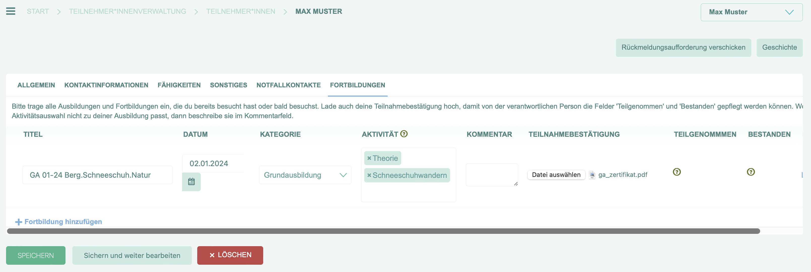
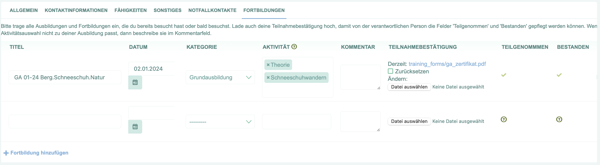

.. _user_manual/training:

Fortbildungen
=============

Auf dieser Seite werden deine Aus- und Fortbildungen innerhalb der Organisation
verwaltet. Hier kannst du deine Fortbildungen hinzufügen und Teilnahme-Zertifikate hochladen.

Eine Fortbildung hinzufügen
---------------------------

Um eine Fortbildung hinzuzufügen, musst du zunächst auf dein persönliches Profil gehen. Das findest du im Menü ganz oben unter "Mein Profil".
In deinem Profil gibt es den Reiter "Fortbildungen". Dort findest du eine Übersicht aller Fortbildungen, die du bereits hinzugefügt hast.
Ganz unten kannst du eine neue Zeile hinzufügen. Für jede Fortbildung musst du einen Titel, ein Datum, eine Kategorie (z.B. das Format der Fortbildung) und mindestens eine Aktivität (die behandelten Themen der Fortbildung) angeben.
Außerdem kannst du in einem Kommentarfeld weitere Details zur Fortbildung eintragen und ein Teilnahme-Zertifikat als Bild oder PDF hochladen.

Deine Änderungen musst du abschließend speichern, z.B. indem du unten auf den Button "Speichern" klickst.

Eine für die Fortbildungen relevante Person kann deine Einträge anschließend prüfen und bestätigen, dass du teilgenommen und auch bestanden hast.

Max hat direkt seine Grundausbildung in seinem Profil eingetragen und das Teilnahme-Zertifikat hochgeladen. Hier muss er den Eintrag nur noch speichern.

So konnte die zuständige Person seine Fortbildung schnell prüfen und bestätigen. Wenig später sieht Max nun in seinem Profil, dass seine Grundausbildung bestätigt wurde.

Fortbildungen verwalten
-----------------------
.. note::
   Dieser Abschnitt ist nur für Personen relevant, die Fortbildungen prüfen und bestätigen dürfen.

Nachdem eine Fortbildung von einer Person eingetragen wurde, die sie besucht hat, kannst du sie im Menü "Ausbildung" > "Fortbildungen" einsehen.

1. Du solltest die Fortbildung und alle angegebenen Details inhaltlich prüfen.
2. Wenn alles in Ordnung ist, kannst du die Fortbildung bestätigen, indem du die Felder "Teilgenommen" und "Bestanden" befüllst und die Fortbildung speicherst.
